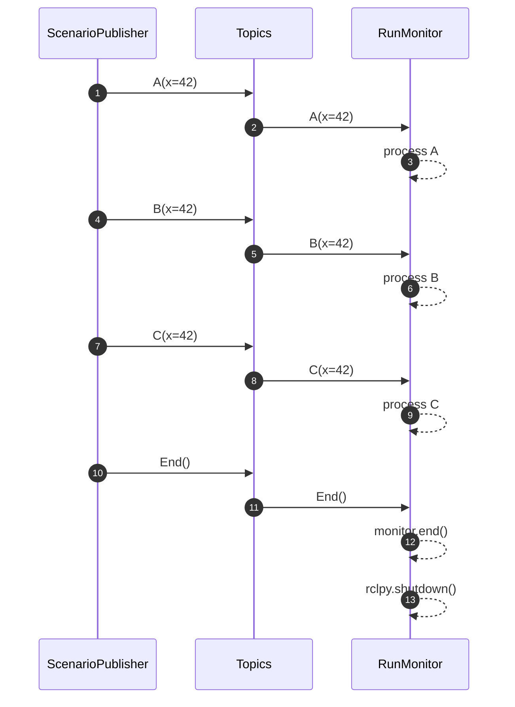

# PyContract ROS2 Package

## ROS2 Build

Make sure ROS2 Jazzy or later is installed.

See: [ROS2 Jazzy installation](https://docs.ros.org/en/jazzy/Installation.html)

```bash
# The project repository can be used as a ROS workspace
source /opt/ros/<ros2-distro>/setup.bash or setup.zsh

# The list of packages:
colcon graph
# Will produce:
# pycontract           +**
# examples_ros2         + 
# pycontract_examples    +

# Build all the packages in this repository
colcon build

# Source the installed packages
source install/setup.bash
```

## ROS2 Usage

### ROS2 Examples

This repository provides example ROS2 nodes for testing and monitoring contract-based systems using pycontract.

#### run_monitor (ROS2 equivalent of [examples/run_monitor.py](./examples/run_monitor.py))

```shell
ros2 launch examples_ros2 test_monitor.launch.py
```

The above will result in the following interactions:


