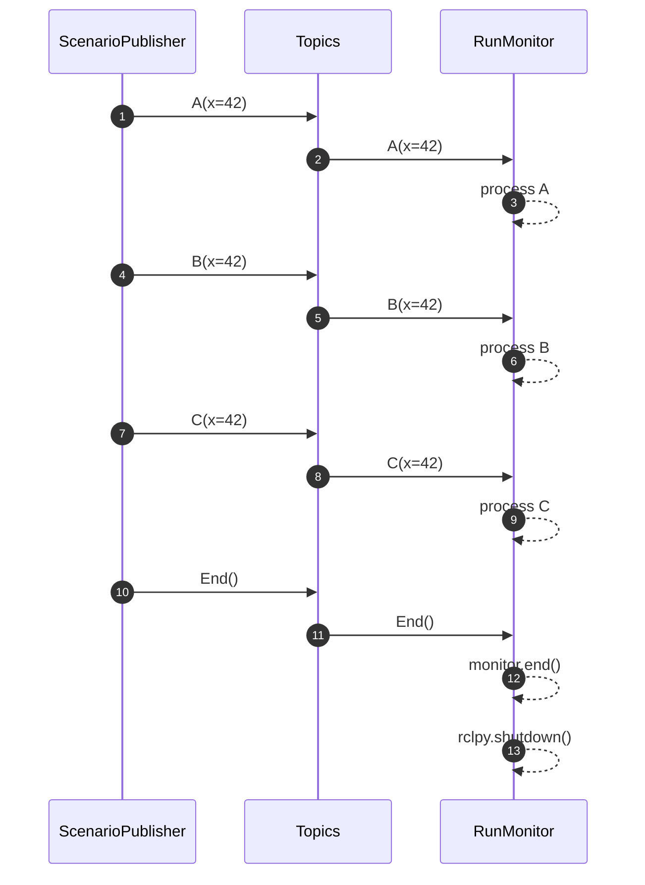

# PyContract ROS2 Package

## ROS2 Installation

Make sure ROS2 Jazzy or later is installed.

See: [ROS2 Jazzy installation](https://docs.ros.org/en/jazzy/Installation.html)

Note: For RHEL9, the instructions at <https://docs.ros.org/en/jazzy/Installation/RHEL-Install-RPMs.html> will fail because of GPG signature checking. Use the following instructions instead (tested on RHEL9.5):

```shell
# 1. (One-time) import the ROS public key so later RPMs are verified
sudo rpm --import https://raw.githubusercontent.com/ros/rosdistro/master/ros.asc

# 2. Install the bootstrap RPM with GPG checking turned off
sudo dnf install -y --nogpgcheck \
  "https://github.com/ros-infrastructure/ros-apt-source/releases/download/${ROS_APT_SOURCE_VERSION}/ros2-release-${ROS_APT_SOURCE_VERSION}-1.noarch.rpm"

# 3. Refresh metadata and install Jazzy
sudo dnf makecache
sudo dnf install ros-jazzy-desktop     # or ros-jazzy-ros-base, etc.
```

## ROS2 Build

```bash
# The project repository can be used as a ROS workspace
# Automatically picks the correct script for bash, zsh, fish, …
source /opt/ros/<ros2-distro>/setup.$(basename $SHELL)

# The list of packages:
colcon graph
# Will produce:
# pycontract           +**
# examples_ros2         + 
# pycontract_examples    +

# Build all the packages in this repository
colcon build

# Source the installed packages
source install/setup.bash
```

## ROS2 Usage

### ROS2 Examples

This repository provides example ROS2 nodes for testing and monitoring contract-based systems using pycontract.

#### run_monitor (ROS2 equivalent of [examples/run_monitor.py](./examples/run_monitor.py))

```shell
ros2 launch examples_ros2 test_monitor.launch.py
```

The above will result in the following interactions:


